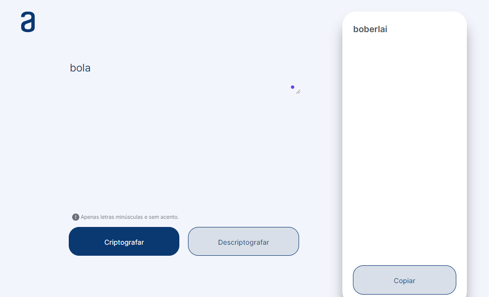

# Alura Challenge #1 | Oracle One | Decodificador de texto


Sobre o Projeto
---
Resultado do primeiro desafio do programa ONE, da Oracle em parceria com a Alura:
- Decodificador de texto com design responsivo feito em HTML, CSS e JavaScript.


Chave de Criptografia
---

As "chaves" de criptografia utilizadas são:<br>
- A letra "e" é convertida para "enter"<br>
- A letra "i" é convertida para "imes"<br>
- A letra "a" é convertida para "ai"<br>
- A letra "o" é convertida para "ober"<br>
- A letra "u" é convertida para "ufat"<br>

Funcionalidade:
---
- Funciona apenas com letras minúsculas
- Não devem ser utilizados letras com acentos nem caracteres especiais, por exlemplo: ponto, vírgula, hastag, arroba, entre outros
- É possível converter uma palavra para a versão criptografada e também retornar uma palavra criptografada para a versão original.

Por exemplo:
"casa" => "caisai"
"bola" => "boberlai"


## Rodando localmente

Clone o projeto

```bash
  git clone 
```

Entre no diretório do projeto

```bash
  cd my-project
```

Clique no index.html


## Stack utilizada

**Front-end:** HTML, CSS e JS

## Screenshots




